# Proof of SRE candidate

## Scenario:
You are tasked with automating the deployment of a microservice application to a Kubernetes cluster in AWS using ArgoCD or FluxCD for GitOps-based continuous deployment. The application consists of multiple services, each with its own Docker image. Your goal is to create an infrastructure as code (IaC) script that provisions the necessary AWS resources, sets up Kubernetes, integrates with ArgoCD or FluxCD, and deploys the application reliably.

## Requirements:
* Use Terraform to define the infrastructure and provision AWS resources, including Kubernetes cluster components.
* Set up Kubernetes in AWS using tools like eksctl or Terraform.
* Integrate ArgoCD or FluxCD into the deployment pipeline for GitOps-based continuous deployment.
* Ensure that the deployment is scalable and resilient to failures.
* Implement monitoring and logging configurations for the application.
* Document your code and provide instructions for deploying and managing the application.

## Evaluation Criteria:
* Correctness: Does the code successfully provision the required AWS resources, set up Kubernetes, integrate with ArgoCD or FluxCD, and deploy the application to the cluster?
* GitOps Integration: Are both ArgoCD or FluxCD configured to automatically synchronize and deploy changes from a Git repository?
* Scalability and Reliability: Is the deployment designed to scale efficiently and handle failures gracefully?
* Monitoring and Logging: Are monitoring and logging configurations implemented effectively to ensure observability of the application?
* Code Quality: Is the code well-organized, documented, and follows best practices?
* Documentation: Are deployment instructions clear and comprehensive?

## Example Submission (Using Terraform, ArgoCD or FluxCD in AWS):

```
# main.tf 

# Provision EKS cluster using eksctl or Terraform module

# Configure kubectl to access the EKS cluster

# Install ArgoCD or FluxCD in the Kubernetes cluster

# Define Kubernetes resources for the microservice application 

# Define AWS resources (e.g., VPC, subnets, security groups) as needed

# Define IAM roles and policies for EKS cluster access 

# Implement monitoring and logging configurations (e.g., CloudWatch, Prometheus, Fluentd)

# Document deployment instructions, including how to configure ArgoCD or FluxCD for GitOps-based continuous deployment
```

## Submission Notes:
The Terraform script provisions AWS resources, sets up Kubernetes in EKS, and installs ArgoCD or FluxCD.
Kubernetes resources for the microservice application and AWS resources (e.g., VPC, subnets, security groups) should be defined as needed.
Monitoring and logging configurations (not shown) should also be included.
Detailed deployment instructions should be provided in the documentation.

---

## Report & Solution Explanation:

### Provision EKS cluster using eksctl or Terraform module

Everything related to the creation and provisioning of the Kubernetes cluster is in the [main.tf](./main.tf) file. The code is commented, so it is advisable to use the comments to complement the information described here. It should be noted that prior to the creation of the module, the networks in which the cluster was to be deployed were created.

The __terraform VPC module__ has been of great help in the creation of this resource. <u>Three public networks and three private networks</u> have been created (within which the Kubernetes resources will be hosted, protected from the outside). A NAT gateway has been used to allow them access to the outside.

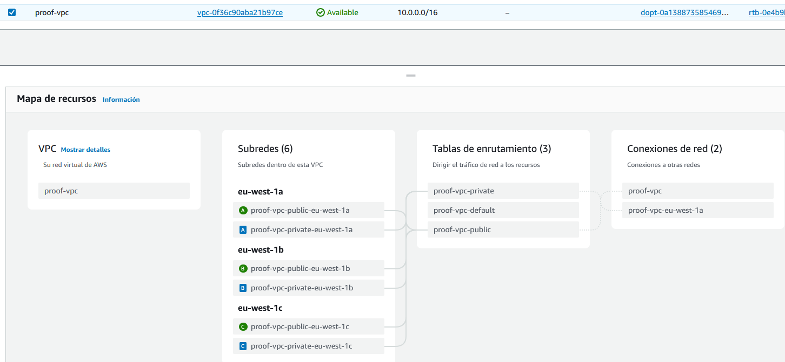

Once we have defined the networks in which our cluster is going to be deployed, we have used the __terraform eks module__. It makes it easier for us to create and provision the EKS cluster. It also <u>automates the creation of roles in AWS and policies</u> associated with them to make their management easier.

It was decided to create a cluster based on <u>Amazon Linux 2 64-bit</u>. To ensure __high scalability and fault tolerance__, it was decided to create __two node groups__ with different minimum, maximum and desired sizes. This allows the cluster to dynamically adjust to resource demand.


Also, it is important for any Kubernetes system to implement <u>persistent storage management</u>. That is why we have used the __terraform ebs module__ as cluster_addon with its associated policy and role that allowed this function at the application level.

You can check this first hand, and with more explicit comments, in the [main.tf](./main.tf) file in the EKS section.

### Configure kubectl to access the EKS cluster


Once the cluster is deployed, the steps to join kubectl with your EKS cluster are simple, these are the steps:

1. [Install Kubectl for Linux](https://kubernetes.io/es/docs/tasks/tools/included/install-kubectl-linux/)
2. Take the <u>region</u> and the <u>cluster name</u> from the AWS console or the terraform output when the apply has done.
3. Exec this command: `aws eks --region <region> update-kubeconfig --name <cluster_name>`
4. Verify installation, for example, executing: `kubectl cluster-info`. You will see something like this:

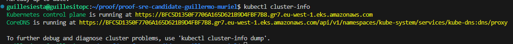

### Install ArgoCD or FluxCD in the Kubernetes cluster

__FluxCD__ is the one to choose from because it integrates more <u>seamlessly and natively with Kubernetes</u>. It doesn't require an external server and runs directly within the cluster, simplifying deployment and management.

For this purpose, it has been decided to use the __terraform "flux" provider__ . But, first of all, the __terraform provider "kubernetes"__ and the __terraform provider "github"__ have been used. Because <u>flux has to be integrated with both providers</u> in order to perform its powerful functions. 

Note that in this case it has been decided to use __providers__ because with the *Kubernetes providers*, you can directly define and <u>manage specific resources within the cluster</u>, such as Namespaces, Deployments or Services, without depending on how a module prepackages these resources. In this case, the possibility of <u>namespaces</u>, the <u>easy integration with other environments</u> and the <u>not complex configuration needed</u> has been key to deciding on this option.

To quickly <u>connect our fluxcd with our github repository</u>, we have decided to create a __github token__ with a series of write and read permissions on the same repo. Also we have created a dedicated kubernetes __namespace__ resource called __flux-system__.

For the protection of __secrets__, in this case the *github token*, a kubernetes secret resource has been created to store the token within the cluster in the <u>flux-system namespace</u>.


Everything needed to carry out this section is well described in the files [main.tf](./main.tf) and [terraform.tf](./main.tf). Both the declaration of the providers and the steps necessary for fluxcd to start boostrapping.

### Define Kubernetes resources for the microservice application

This is where the most __fun part__ of the whole project comes in. Once we have everything set up, it's as simple as using __GitOps__ to do cool stuff on our Kubernetes cluster.

According to how flux works, there's a file called [kustomization.yaml](/clusters/my-cluster/flux-system/kustomization.yaml). Stored in the directory we mentioned when we defined the creation of flux bootstrap git (you can check it in the code on *line 162* in the [main.tf](./main.tf) file).

Well, this file is a kind of list of resources that Kubernetes will deploy. *It's that simple*. For this little test, I decided to make a small service that would deploy a container where you could *play Super Mario* in the <u>default</u> namespace. To do this, I created two files, one for the [deployment](/clusters/my-cluster/flux-system/deployment.yaml) (with a *docker image* that runs Super Mario) and another for the [service](/clusters/my-cluster/flux-system/service.yaml) so that the __service__ would be exposed to the outside through a __load balancer__.

Once these files were committed to the Git repository, the process was automatic:

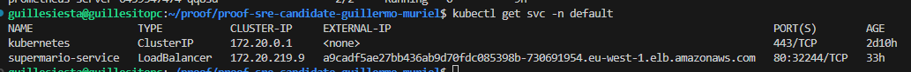

And now we can play Super Mario thanks to FluxCD and EKS:


### Define AWS resources (e.g., VPC, subnets, security groups) as needed & Define IAM roles and policies for EKS cluster access

I saw that it would be very necessary to have a <u>clear understanding of the networking</u> issue before deploying anything. With a solid network architecture I could achieve a fault-tolerant, scalable and resilient service.

As I mentioned at the beginning, thanks to the __wonderful terraform modules__, this manual and tedious part of defining policies and roles for the use of AWS services was __automated__ incredibly well.

Among these resources, the provision of __resource groups__ and __autoscaling groups__ were automated. Here you can see how, thanks to Terraform and the use of its resources, it automates security group definitions as large as this one. <u>Since this is a short project, this is something that is greatly appreciated</u>.

Here you can see the __security group__ of one node:

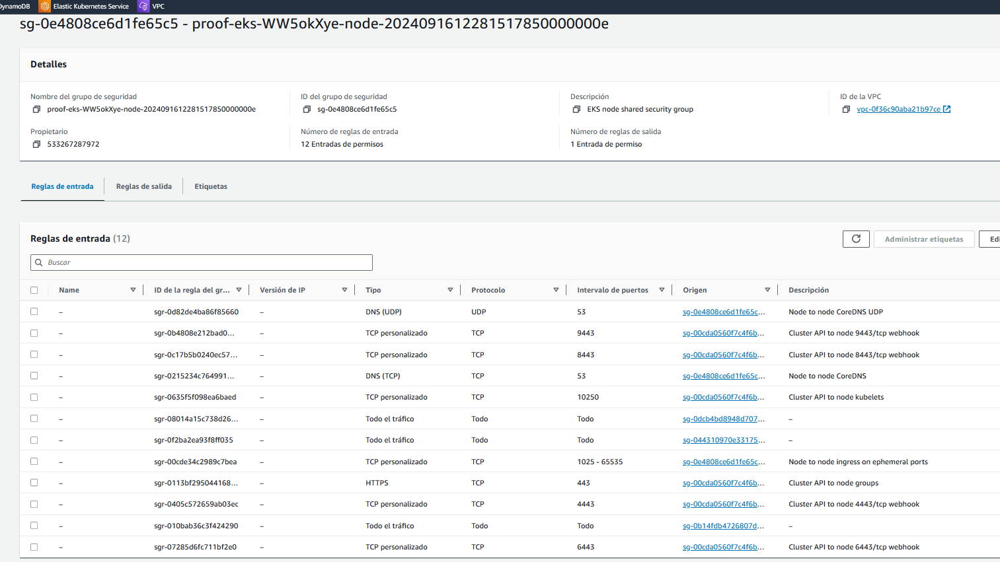

Here you can see the __autoscaling groups__. You can see that there are two auto-scaling groups. <u>One autoscaling group for each node group</u>:

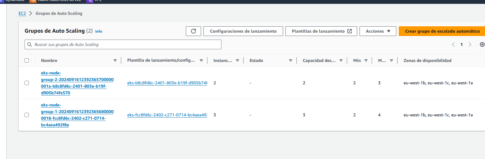

Here I show, a screenshot of some __IAM__ roles created for this project.

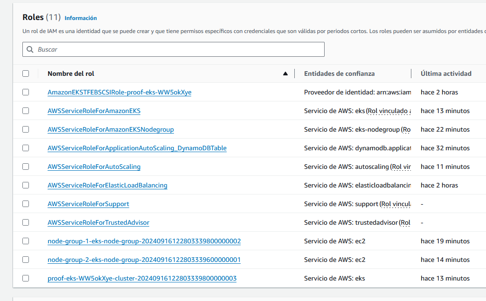

### Implement monitoring and logging configurations (e.g., CloudWatch, Prometheus, Fluentd)

For this part I have decided to use __Helm__. One of the reasons that led me to do so was to show how <u>powerful</u> it is for <u>quick installations</u> of different programs within a cluster. In this case I will use it to install Prometheus and Grafana in the cluster.

__Prometheus__ is an open source tool designed to collect metrics from systems and applications in real time.

__Grafana__ is a data visualization and monitoring tool that integrates with Prometheus. It also has the ability to set alerts.

As you can see in the [terraform.tf](./terraform.tf) file, I have added __Helm__ as a __terraform provider__.

Once this is done, in the [main.tf](./main.tf) file, you can see how I use __helm-charts__ to install both Prometheus and Grafana. Both within the __"monitoring" namespace__ and with their corresponding configurations.

Once we have both Grafana and Prometheus in our cluster:

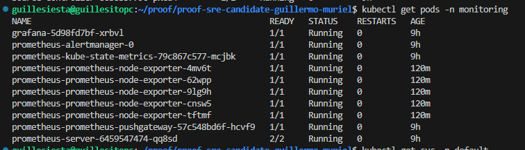

But here we come across the <u>problem</u> that these services are within our private networks, that is, <u>they are not accessible from the outside</u>. The <u>solution</u> would be simple, we create a <u>Kubernetes LoadBalancer</u> that externalizes these resources.

But where do we put these resources easy and quick? This is where FluxCD and the wonder of __GitOps__ comes to the rescue.

The __solution__ is as simple as creating both services: [grafana-service.yaml](/clusters/my-cluster/flux-system/grafana-service.yaml) and [prometheus-service.yaml](/clusters/my-cluster/flux-system/prometheus-service.yaml), adding them to the corresponding folder in the repository, in this case "clusters/my-cluster/flux-system" and then adding them to the [kustomization.yaml](/clusters/my-cluster/flux-system/kustomization.yaml).

Once this files are commited, then you can see this:

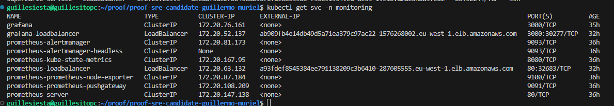

Here you can see that two new services has appeared. These new load balancers will allow you to access via web browser to Prometheus: 

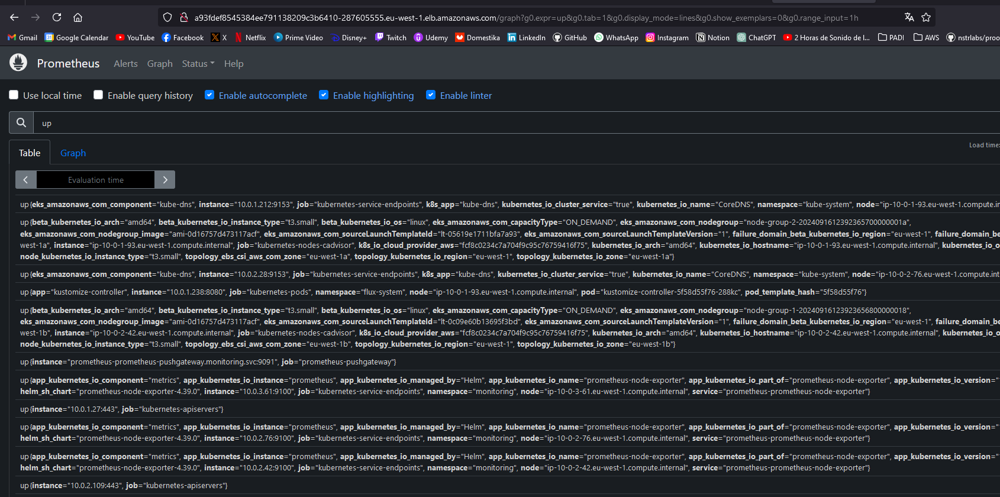

and Grafana: 

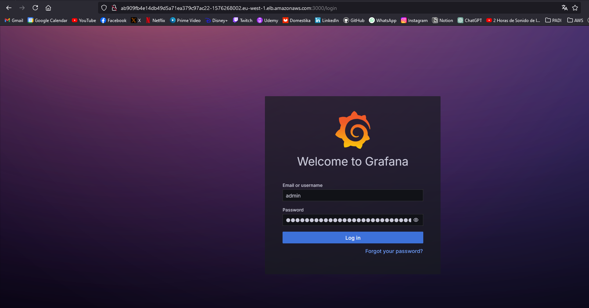

Thanks to these components we can now __monitor__ our infrastructure in __real time__.

In order to securely connect Prometheus with Grafana, we have to add the Prometheus service that is not outsourced as a __data source__. In this case, the following data source should be added: `http://prometheus-server.monitoring.svc.cluster.local:80`.

Once it is added, it is as simple as creating a new __dashboard__, importing one from the web. In this case, a dashboard has been imported for __node exporter__.

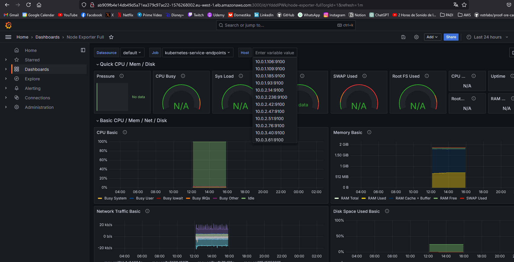

One of the __advantages__ that both Prometheus and Grafana offer us is the creation of __Alerts__. Something quite interesting in terms of <u>fault tolerance</u> and <u>reliability</u> of a system.

From here, <u>the limit of installations on our server is almost infinite</u>. __Helm__ has proven to be a reliable tool when it comes to installing __new helm-charts__ for any functionality we need in our cluster. For example, __fluentd__, a log collection and analysis system that is especially good for distributed architectures and Kubernetes.

### Deployment instructions

To run this project, you need to have a version of terraform > 1.9.0 installed and AWS cli configured on your PC.

Also, you need to have in AWS an s3 created and a dynamoDB table with the names that appear at the beginning of the [terraform.tf](./terraform.tf) file.

Then you can run the best and easiest commands in the world:
1. `terraform init`
2. `terraform plan`
3. `terraform apply`


---

### Possible improvements to the project.

- Implementation of certificates.
- Implementation of more services. 
- Implementation and creation of alerts in both Prometheus and Grafana.
- Provisioning DNS records so that the gigantic AWS URLs do not appear.
- Adding a user and password to the terraform service.
- Implementing [Cluster Autoscaler](https://github.com/kubernetes/autoscaler) to ensure that all pods have a place to run.
- Finish implementing logging, for example fluentd with Helm.
- Remove secret token from [variables.tf](./variables.tf)
- ...

Please feel free to tell me about any further improvements.

Thanks.

Guille.